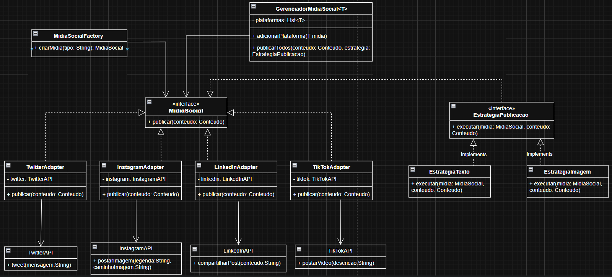

## Sistema de Integração de Redes Sociais com Padrão Adapter 

Descrição
Este projeto implementa um sistema de integração unificada de múltiplas redes sociais utilizando padrões de design de software:

- Adapter: Para adaptar diferentes APIs de redes sociais a uma interface comum (MidiaSocial).
- Strategy: Para permitir diferentes estratégias de publicação (EstrategiaTexto, EstrategiaImagem).
- Factory Method: Para criar instâncias dos Adapters de forma centralizada (MidiaSocialFactory).

O sistema suporta atualmente Twitter, Instagram, LinkedIn e TikTok, mas pode ser expandido facilmente para novas plataformas.

Estrutura do Projeto

1. Classe Conteudo

Responsável por armazenar o conteúdo a ser publicado nas redes sociais.

public class Conteudo {
    private String texto;
    private String imagem;

    public Conteudo(String texto, String imagem) { ... }
    public String getTexto() { ... }
    public String getImagem() { ... }
}

Atributos: texto, imagem
Métodos: getTexto(), getImagem()

2. Interface MidiaSocial

Interface comum para todos os Adapters.

public interface MidiaSocial {
    void publicar(Conteudo conteudo);
}

Todos os Adapters implementam esta interface para garantir consistência.

3. APIs Originais

Simulam as APIs reais das redes sociais:

public class TwitterAPI { public void tweet(String mensagem) { ... } }
public class InstagramAPI { public void postarImagem(String legenda, String caminhoImagem) { ... } }
public class LinkedInAPI { public void compartilharPost(String conteudo) { ... } }
public class TikTokAPI { public void postarVideo(String descricao) { ... } }

4. Adapters

Adaptam cada API original para a interface MidiaSocial.

public class TwitterAdapter implements MidiaSocial { ... }
public class InstagramAdapter implements MidiaSocial { ... }
public class LinkedInAdapter implements MidiaSocial { ... }
public class TikTokAdapter implements MidiaSocial { ... }

Cada Adapter contém sua API original (composição).
Implementa o método publicar(Conteudo) usando a API correspondente.

5. Strategy

Define como o conteúdo será publicado.

public interface EstrategiaPublicacao {
    void executar(MidiaSocial midia, Conteudo conteudo);
}

public class EstrategiaTexto implements EstrategiaPublicacao { ... }
public class EstrategiaImagem implements EstrategiaPublicacao { ... }

EstrategiaTexto: publica apenas o texto do conteúdo.
EstrategiaImagem: publica texto + imagem.
O GerenciadorMidiaSocial usa uma instância de EstrategiaPublicacao para publicar em todas as plataformas.

6. GerenciadorMidiaSocial

Gerencia múltiplas plataformas de mídia social.

public class GerenciadorMidiaSocial<T extends MidiaSocial> {
    private List<T> plataformas;
    public void adicionarPlataforma(T midia) { ... }
    public void publicarTodos(Conteudo conteudo, EstrategiaPublicacao estrategia) { ... }
}

Mantém uma lista thread-safe de Adapters.
Publica conteúdo em paralelo usando a estratégia definida.

7. Factory

Cria instâncias dos Adapters de forma centralizada.

public class MidiaSocialFactory {
    public static MidiaSocial criarMidia(String tipo) { ... }
}

Facilita a adição de novas redes sociais sem modificar código existente.
Evita acoplamento direto no Main.

8. Main

Exemplo de uso do sistema:

public class Main {
    public static void main(String[] args) {
        GerenciadorMidiaSocial<MidiaSocial> gerenciador = new GerenciadorMidiaSocial<>();
        gerenciador.adicionarPlataforma(MidiaSocialFactory.criarMidia("twitter"));
        gerenciador.adicionarPlataforma(MidiaSocialFactory.criarMidia("instagram"));
        gerenciador.adicionarPlataforma(MidiaSocialFactory.criarMidia("linkedin"));
        gerenciador.adicionarPlataforma(MidiaSocialFactory.criarMidia("tiktok"));

        Conteudo conteudo = new Conteudo("Lançando novo produto!", "imagem.png");
        EstrategiaPublicacao estrategia = new EstrategiaTexto();

        gerenciador.publicarTodos(conteudo, estrategia);
    }
}

Cria o gerenciador de mídias sociais.
Adiciona Adapters via Factory.
Cria o conteúdo e escolhe a estratégia de publicação.
Publica em todas as plataformas de forma paralela e segura.

9. Requisitos Atendidos ✅

- Não modificar APIs originais
- Composition over inheritance
- Tratamento de erro granular
- Uso de generics
- Thread-safe
- Strategy
- Factory Method
- Configuração por ambiente
- Executável no terminal

10. Diagrama de classe

